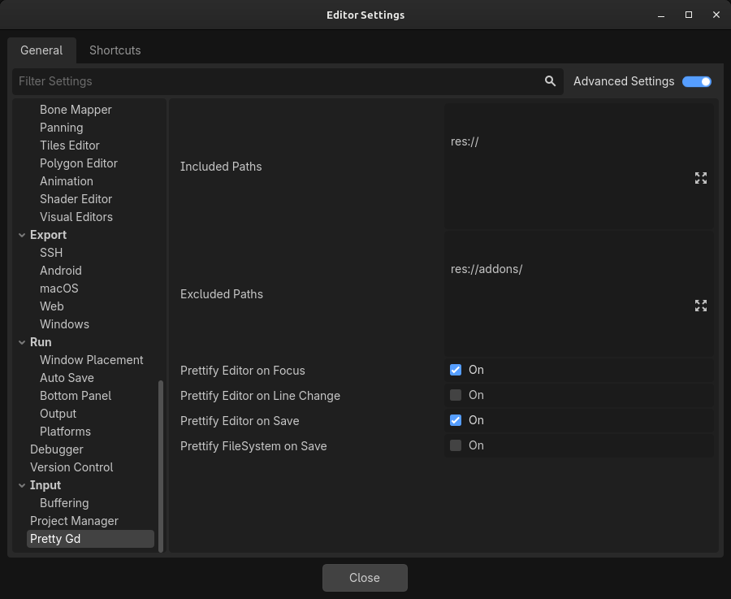

# pretty.gd for Godot


A formatter for GDScript that just works!

No Python! No binaries! No dependencies!

## Usage

### Godot editor

1. Backup or commit your code first, just in case! 
2. Install the plugin in the `res://addons/` folder.
3. Enable the plugin in project settings.
4. Adjust editor settings to your liking.



5. Profit! Your GDScripts will be prettified automatically when you save.

### GDScript API


#### Example

```gd
extends Node

var Prettifier = preload("res://addons/pretty-gd/pretty.gd").new()

func _ready():
    # configure indentation
    Prettifier.indent_str = "\t"
    Prettifier.tab_size = 4

    let filename = "my_script.gd"
    let input = FileAccess.get_file_as_string(filename)

    let output = Prettifier.prettify(input) # <- This is the main function

    var file = FileAccess.open(filename, FileAccess.WRITE)
    file.store_string(output)
    file.close()
```

## Known Issues

If you come across any other issues with using this software, please [let me know](https://github.com/poeticAndroid/pretty-gd/issues).

## Release Notes

### 0.2

 - Important bugfixes to the tokenizer!
 - More granular controls in the editor settings.

### 0.1

 - First release! 🎉
